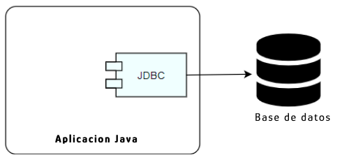

# ¿Que es JDBC?
El JDBC es un API del Java que posibilita que una aplicación construida en el lenguaje consiga introducir un banco de datos configurado local o remotamente.
+ La API es compuesta por los paquetes java.sql y javax.sql, incluidos en el JavaSE. Por medio de las clases e interfaces dados por esos dos paquetes, las personas pueden desenvolver softwares que introduzcan cualquier fuente de datos, desde bancos relacionales hasta planillas.



## Componentes
La API JDBC es compuesta por dos componentes centrales. En primer lugar, podemos hablar de los paquetes (Java.sql y Javax.sql) que contienen las clases e interfaces que padronizan la comunicación de aplicación Java con una base de datos

### Driver
Otro elemento importante son los drivers, verdaderos responsables por la conexión e interacción con un banco específico.
+ Un driver JDBC es una clase que implementa la interface java.sql.Driver. Muchos drivers son totalmente desarrollados con el uso de Java, lo que colabora para ser cargados de manera dinámica.

Los drivers también pueden ser escritos de forma nativa, accesando otras bibliotecas u otros drivers del sistema que permitan acceso a una base de datos determinada.

La clase DriverManager define un conjunto básico de operaciones para la manipulacion del driver adecuado para la conección con un banco. Además de eso, ella también es responsable por realizar la conexión inicial.

## Tipos de Drivers
Todo driver JDBC debe dar soporte mínimo a las funcionalidades especificadas en el estándar ANSI2 SQL-92. A través del driver, la *aplicación Java introduce las implementaciones de clases e interfaces que van a permitir la ejecución de los comandos SQL en una base de datos*.

Hoy la arquitectura del JDBC posee cuatro tipos de drivers diferentes:

+ Tipo 1: La JDBC-ODBC posibilita el acceso a drivers del tipo ODBC, un estándar ya consolidado para el acceso a bases de datos.

+ Tipo 2: En este tipo de driver es implementado el protocolo del propietario del banco de datos. El transforma las llamadas JDBC en llamadas del banco con el uso de la API propietária.

+ Tipo 3: Este tipo de driver hace la conversión de las chamadas JDBC en otras llamadas del banco de datos, que son dirigidas para una capa intermediaria de software, el middleware. Así, la llamada será convertida para el protocolo del banco.

+ Tipo 4: Son escritos puramente en Java e implementan el protocolo propietario del banco de datos. En general, tiene desempeño superior, ya que introducen directamente el SGBD, sistema gerenciador de banco de datos.

## Usando el JDBC
Ahora vamos a ver de manera práctica como utilizar el JDBC para implementar una conexión con una base de datos. En los ejemplos abajo, utilizamos el postgresql como fuente, pero la idea central puede ser replicada para otros bancos de datos relacionales

Como en una receta de torta, vamos a seguir un guion básico para a manipulacion de los datos. Nuestros pasos iniciales serán:

+ Definir la clase que implementa el driver JDBC, vamos a usar org.postgresql.Driver;
+ Definir el *string de conexión del banco de datos, básicamente una cadena de caracteres con informaciones para conectar. Es importante mencionar que la manera de definir esta string varía entre bancos diferentes. Tú puedes explorar más formas de escribir esas strings accesando ConnectionString;
+ Definir el nombre de usuario y contraseña (aquí llamada de "senha") para conectarnos en el banco de datos.

códigos con el paso a paso:

``` java
// Informaciones para conectar con el banco de datos.
String stringconexion = "jdbc:postgresql://localhost:5432/miBD";
String usuario = "postgres";
String senha = "postgre";
try {
    // Cargando el dflver del banco de datos.
    Class.forName("org.postgresql.Driver");
    // Creando la conexion con el banco de datos.
    Connection con = DriverManager.getConnection(stringconexion,usuario,senha);
}
catch (Exception ex)
{
    throw new RuntimeException(ex.getMessage());
}
```
Realizada la conexión con el banco de datos, llega el momento de ejecutar las operaciones de consulta, inserción, actualizaciones y eliminación de informaciones. Tenemos un conjunto de clases e interfaces ya preparados para eso. Ellas son:

+ Connection - Representa una sesión junto al banco de datos deseado. Vimos la clase en el trecho de código del ejemplo anterior y vamos ejecutar las instrucciones SQL dentro de la conexión establecida.
+ Statement - Tiene como objetivo la ejecución del comando SQL. Tenemos también la PreparedStatement, que pre-compila el comando y almacena el SQL en un objeto.
+ ResultSet - Esta interface tiene por objetivo almacenar el retorno de una consulta realizada en el banco de datos. Las informaciones de las tablas son recuperadas en la secuencia y pueden ser iteradas en loops para la manipulación.

Vamos ahora a visualizar la escrita de una consulta usando los recursos JDBC.
``` java
// Creando una conexión con el banco de datos.
Connection connect = getConnection();

// Creando un objeto conteniendo los comandos SQL
Statement stmt = connect.createStatement();

// String con el comando SQL, para ser ejecutado en el banco
String sql = "SELECT * FROM alumnos";

// Con el objetivo y la realizacion de una consulta en los banco de datos, vamos a elegir
// el retorno e iniciar un objeto ResultSet, especifico para ratar el retorno de las consultas
ResultSet rs = stmt.executeQuery(sql);

// Ahora veremos el procedimiento de atravesar el objeto y exibiendo los datos
while(rs.next()) {
    System.out.pirntln("#" + rs.getInt("id") + " # " + rs.getString("nombre"));
}

// Cerramos el objeto
rs.close();
stm.close();

// Cerramos la Conexión
connect.close();
```
Ahora veremos los códigos para la escrita de las operaciones de insert, update y delete . El ejemplo muestra un INSERT, pero la lógica será la misma para las demás acciones.
``` java
// Creando una conexion con la base de datos
Connection connect = getConnection();

// String con el comando a ser ejecutado en el banco
String sql = "INSERT INTO alumnos VALUES (?,?,?)";

// Creando un objeto conteniendo los comandos SQL
PreparedStatement ps = connect.preparedStatement(sql);
ps.setLong(1, 2);
ps.setString(2, "James T. Kirk");
ps.setString(3, "mat03");

// Ejecutamos el comando en la base de datos
int resultado = ps.executeUpdate(sql);
if (resultado == 1) {
    System.out.println("Datos insertados con exito!");
}

// Cerramos el objeto
ps.close();

// Cerramos la conexión
connect.close();
```
Al final, podemos definir los siguientes pasos para usar el JDBC:
1. Realizar el cargamento del driver del banco.Class.forName("org.postgresql.Driver").
2. Crear la conexión con el banco. DriverManager.getConnection(stringconexion,usuario,contraseña).
3. Preparar o comando a ser executado en el banco. String sql="SELECT* FROM alumnos"
4. Ejecutar el comando. *En este punto, vale la pena estar atentos: cuando se trata de una consulta, usamos executeQuery, cuando se trata de un insert, update o delete, usamos executeUpdate*
5. Tratar el resultado. Cuando fuera el retorno de una consulta (ResultSet), vamos iterar el objeto. Si fuera el retorno de insert, update o delete, debemos evaluar el valor retornando.

### Conclusión
El JDBC es una API poderosa para manipular base de datos, pues nos permite usar una estructura básica para conectar, además de interactuar por medio del código Java en diversas fuentes de datos, facilitando el trabajo de desarrolladores Java. Los ejemplos de este articulo tiene como objetivo mostrar de manera simple como utilizar la API.